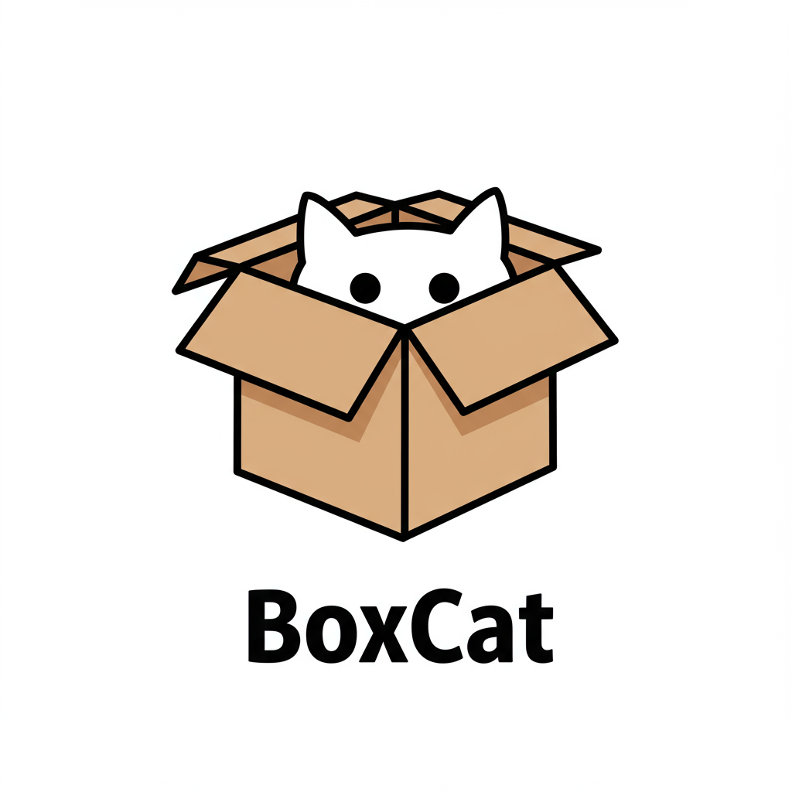

<div style="text-align: left">

[](https://github.com/dykstrom/boxcat/actions/workflows/go.yml)


</div>

# BoxCat

Think inside the box. With cats.

BoxCat is a whimsical, cat-themed esoteric programming language where all computation happens with the help of a curious Cat and a collection of cardboard boxes.



## What is BoxCat?

BoxCat is a programming language inspired by the unpredictable and playful nature of cats. Each program consists of commands that direct a Cat to interact with boxes, move values around, perform calculations, and control the flow of execution.

- **Boxes** are named memory cells that can hold integer values.
- **The Cat** acts as the accumulator, holding a single integer value in its Paw.
- **Commands** are written in a readable, cat-themed syntax.

## Example: Print the numbers 1 to 5

```text
POUNCE ON 1             # Put 1 in the Cat's Paw
SIT IN BOX              # Store 1 in BOX, Paw is now 0

LOOP_START:
PEEK INSIDE BOX         # Paw = BOX
MEOW                    # Output the current number
POUNCE ON 1
PURR AT BOX             # Paw = Paw + BOX (increment)
SIT IN BOX              # Store incremented value back in BOX, Paw = 0
PEEK INSIDE BOX         # Paw = BOX
POUNCE ON 6
HISS AT BOX             # Paw = 6 - BOX
IF CAT CURIOUS, LEAP TO LOOP_START  # If not zero, loop again

POUNCE ON 10            # Output a newline
YOWL
TAKE A NAP              # End program
```

This program prints the numbers 1 through 5.

## Learn More

See the [language specification](specification.md) for the full list of commands.
